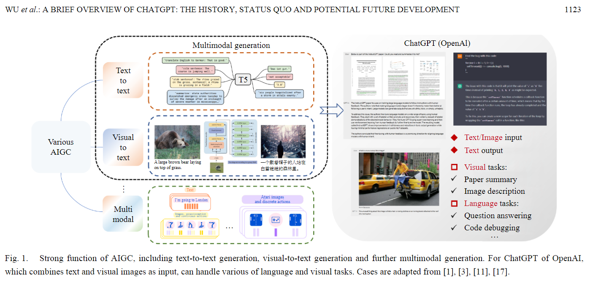
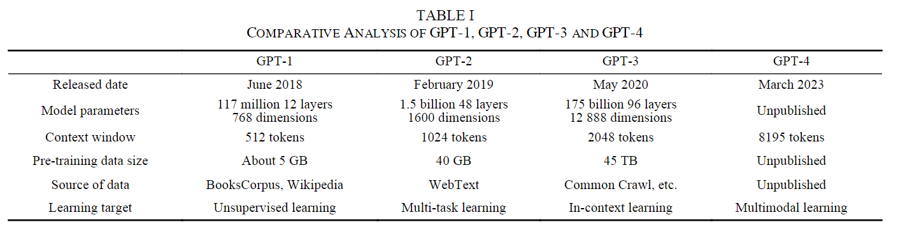
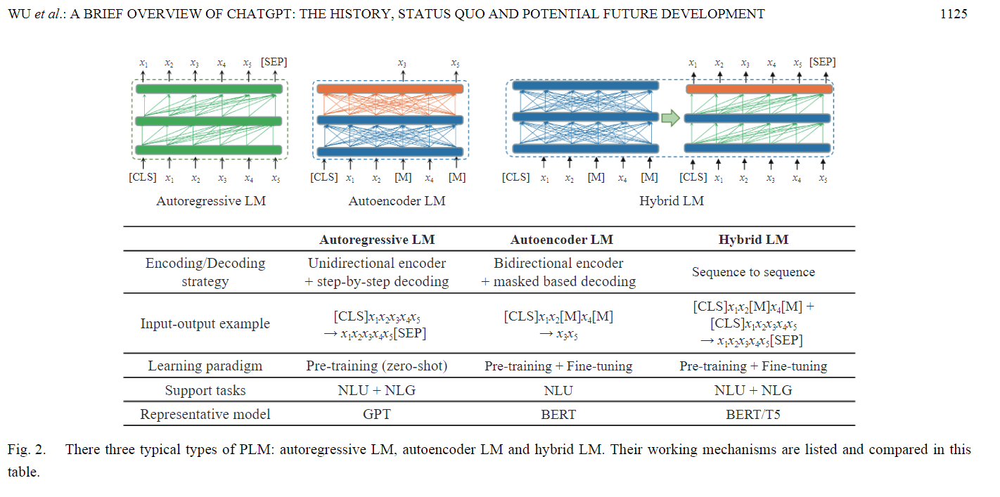
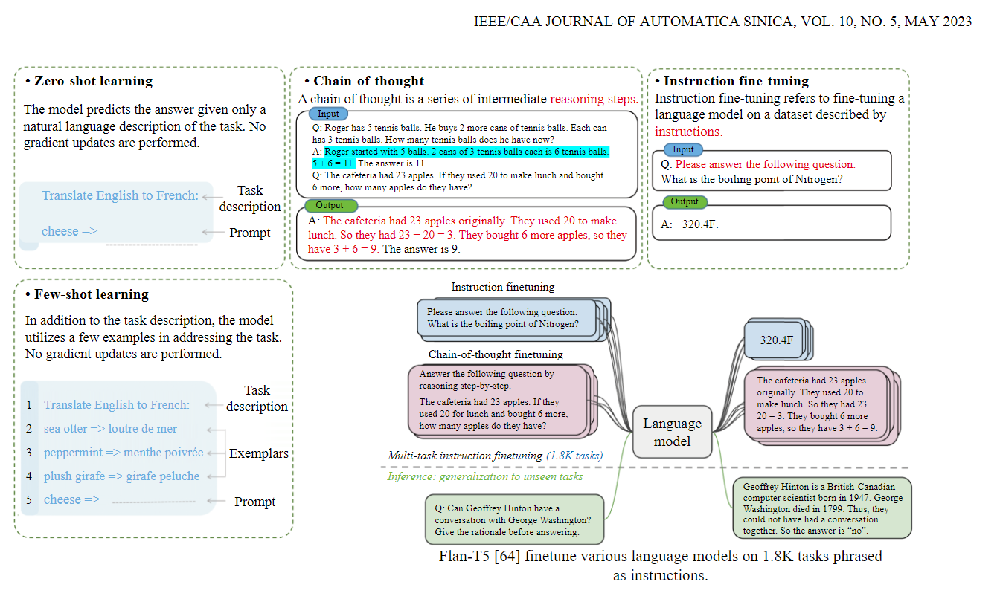
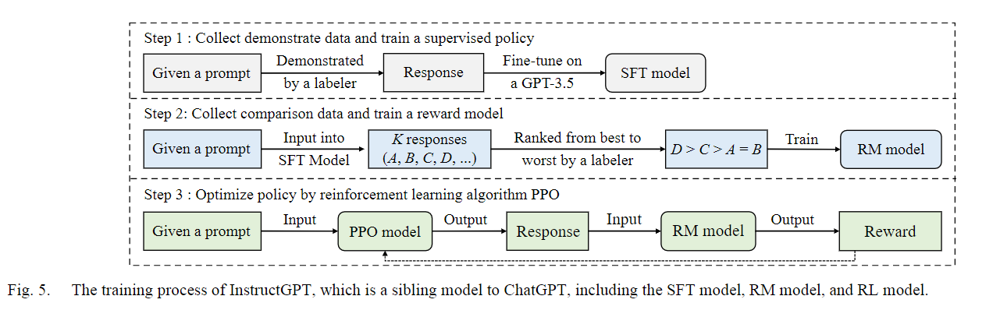
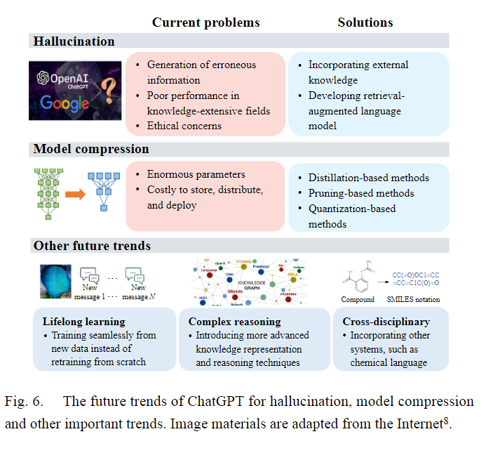

# Generative Pre-trained Transformers

This section contains the literature review for GPT (e.g., ChatGPT) techniques

## Brief Overview of ChatGPT (2023)

Wu, T., He, S., Liu, J., Sun, S., Liu, K., Han, Q.-L., & Tang, Y. (2023). A Brief Overview of ChatGPT: The History, Status Quo and Potential Future Development. IEEE/CAA Journal of Automatica Sinica, Automatica Sinica, IEEE/CAA Journal of, IEEE/CAA J. Autom. Sinica, 10(5), 1122–1136. https://doi.org/10.1109/JAS.2023.123618. [HistoryChatGPT](HistoryChatGPT.pdf).

ChatGPT is an `artificial intelligence generated content (AIGC)` model; which produce images, text, and videos. The solution implements a different DNN architecture that extend:

1. Generative adversarial network (GAN)
1. diffusion model
1. multimodal generations

There are many intelligent robots available across the market. What makes ChatGPT unique, is ability to incorporate historic context within the answers.

### What's the difference between model versions

> ChatGPT, with so many strong functions, is an integration of multiple technologies such as deep learning, unsupervised learning,  instruction  fine-tuning,  multi-task  learning,  in-con-text learning and reinforcement learning.

One reason the model evolved quickly was `reinforcement learning with human feedback (RLHF)`; which asked over 100M users the manually grade predictions. This corpus gives OpenAI a strategic advantage until things changes.

### What is GPT-4 based on

OpenAI is secretative about GPT-4; but its based on `InstructGPT`. It leverages an in-context learning that models general tasks with a self-learning paradigm.

> Since 2018, the pre-trained language models (PLM), which utilize  self-supervised  learning  over  raw  large-scale  texts, have received more and more attention [42]. And it promotes the birth and development of the two-stage learning paradigm of  pre-training  and fine-tuning.At present, there are three typical model structures of PLM, autoregressive  LM, autoencoding  LM,  and  hybrid  LM.

### What is in-context learning

> WWith the support of ICL (`In-Context Learning`), GPT-3.5 series models can achieve good results without any train-ing  and  fine-tuning  of  NLP  tasks,  and  even  achieved  very shocking  results  in  some  logical  and  creative  tasks  such  as article generation and code writing. Next, we will provide a detailed introduction to ICL and the technologies of chain-of-thought and instruction fine-tuning that promote the success of large models. **In-Context Learning: ICL has become a new paradigm of natural  language  processing**.

### What are language models

> Language  models  are  statistical  models  that  describe  the probability  distribution  of  natural  language  [33].  It  is  dedicated to estimating the probability of a given sentence (e.g., used  to  compute  the  probability  of the sentence   containing   words), or the probability of generating  other  contents  given  a  part  of  the  sentence  (e.g., used to compute the probability of predicting the content of the next part given the content of the previous part of the sentence), which is the core task of natural language processing and can be used on almost all down-stream NLP tasks.

### What are important technical steps

1. Supervised Fine-tuning (SFT)
1. Reward Modeling
1. Reinforcement learning

These capabilities enable ChatGPT to be:

1. Multimodeal
1. Strong Reasoning Ability
1. Knowledge Modeling and Planning

### What challenges exist

- Fuzzy queries / reliance on human annotation. The whole model relies on RLHF, so garbage-in/garbage-out
- Insufficient modeling of explicit knowledge; the industry is gravitating toward 100B parameter models. however, most use-cases are **most probable next word**. This means there's significant waste and potential for optimization.
- Research costs are high. For  example,  the  training  of  the  basic large model GPT-3 costs 12 million US dollars. In fact, the instability of large-scale data and large model training requires continuous data, code, and engineering tuning, which requires long-time technical accumulation and rich experience in system optimization

### What's the impact of ChatGPT

> From  an  academic  perspective,  ChatGPT  is  an  important milestone in the field of AI, revealing the potential for achiev- ing artificial general intelligence. In the past, AI research has mainly focused on the analytical capabilities of models. That is, by analyzing a given set of data, the model aims to discover the features and patterns used in practical tasks. Unlike past AI technologies, ChatGPT is a large-scale generative lan-guage model, and with the publication of GPT-4 image inputs has also been allowed, proving the feasibility of multimodal generation.  ChatGPT  assists  humans  in  a  range  of  tasks  by learning and understanding human intent to generate content in a conversational manner. The emergence of ChatGPT **signifies the transformation of artificial  intelligence from data understanding  to data generation**,  achieving  a  leap  from machine perception to machine creation. Due to its powerful text generation capabilities, ChatGPT has the strong ability to produce  large-scale  synthetic  data  at  a  low  cost.  This  over-comes the data limitation in the process of AI tasks and fur-ther prompts the wider application of AI technology.

### What are researchers concerned about

Researchers also worry about:

1. Intellectual Property Protection (training sources)
1. Safety Aspects (disinformation)
1. Ethics / Integrity (people will cheat with it)
1. Environmental Impact (too much energy)
1. Researchers have shown that the capabilities of transformer-based language models **grow log-linearly with the number of parameters** [113], [114], and some promising abilities such as in-context  learning  [25]  and  chain-of-thoughts  [57]  emerge when  the  model  size exceeds  certain  thresholds.

## Users see others chat history (2023)

OpenAI CEO clarifies why users saw others’ chat history on ChatGPT. (2023, March 24). The Times of India. [OpenAI_CEO_clarifies_why_users](OpenAI_CEO_clarifies_why_users.pdf).

This article discusses a recent code defect that permitted third-party users to view ChatGPT coversation titles. The text defaults to the first question in the thread and could represent a security threat.

## Bug exposed credit card details (2023)

How ChatGPT Bug exposed more than just users’ chat history, including credit card details. (2023, March 26). The Times of India. [How_ChatGPT_Bug_exposed_more_t](How_ChatGPT_Bug_exposed_more_t.pdf).

> Now in an update the company has said that the  bug may have been exposed more, this includes some personal data of ChatGPT Plus subscribers, including their payment information. The payment information that was leaked "Upon deeper investigation, we also discovered that the same bug may have caused the unintentional visibility of payment-related information of 1.2% of the ChatGPT Plus subscribers who were active during a specific nine-hour window. In the hours before we took ChatGPT offline on Monday, it was possible for some users to see another active user's first and last name, email address, payment address, the last four digits (only)of a credit card number, and credit card expiration date. Full credit card numbers were not exposed at any time," OpenAI said in the update.

## Future of ChatGPT and GAI in the Enterprise (2022)

The Future of ChatGPT and Generative AI in the Enterprise, According to Info-Tech Research Group. (2022, December 19). Plus Company Updates. [FutureGPT](FutureGPT.pdf)

TLDR: chatbots are cool and useful. ChatGPT is unique in optimizing for that medium.
