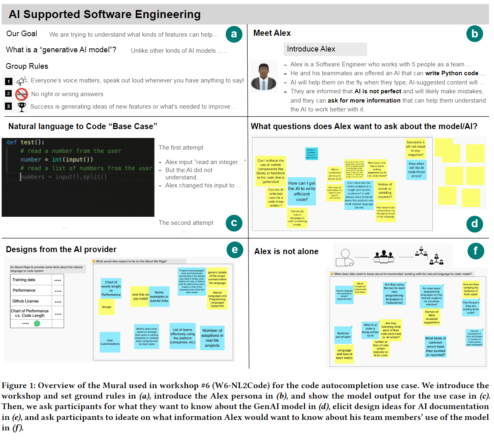

# Explainability in Generative AI

Articles discussing explainability challenges, limitations, and opportunities.

## Investigating Explainability of GenAI for Code (2022)

Sun, J., Liao, Q. V., Muller, M., Agarwal, M., Houde, S., Talamadupula, K., & Weisz, J. D. (2022). Investigating Explainability of Generative AI for Code through Scenario-based Design. 27th International Conference on Intelligent User Interfaces, 212–228. https://doi.org/10.1145/3490099.3511119. [ScenarioDesign.pdf](ScenarioDesign.pdf).

> `Generative AI (GenAI)` is a class of machine learning (ML) algorithms that can learn from content such as text, images, and audio in order to generate new content. In contrast to `discriminative ML algorithms`, which learn decision boundaries, GenAI models produce artifacts as output, which can have a wide range of variety and complexity.

The authors surveyed 43 SDEs through 9 workshops with the goal of uncovering explainability needs and designs around specific scenarios.

> One effective method is scenario-based design (SBD) [87]. SBD suspends the needs to define
system operations by using narrative descriptions of how a user uses a system to accomplish a task, allowing people to respond to concrete interactions. We chose to use SBD to explore GenAI for code use cases as most software engineers do not have experience with such technologies. SBD also allows us to explore XAI design without the constraint of current technical feasibility, as adopted by several prior XAI works [19, 102].

### What are common use cases of GAI for code

> [...] models have emerged that focus on specific domains such as software engineering, implementing use cases of auto-completing code [15, 39], translating code from one program-
ming language to another [88], and converting natural language to code [23]. The industry has begun to use these models to support software engineering practices, with the most prominent example being GitHub CoPilot [27], a GenAI-based co-programming tool.

A standard technique is attribute-driven development & custom compiler extensions. Its worth investigating which of those use cases are enhanced by GenAI.

For instance, can someone 1/ build a sophisticated framework 2/ expose it through annotations and other metadata and 3/ use GenAI to streamline writing those annotations?

In this scenario, you'd decouple the work Sr. SDE should own versus SDE-1 ability to follow the documentation. Presumably, the net effect is SDE-1 make fewer mistakes at a higher developement velocity.

1. **Code translation**, in which a generative model translates source code from one language (e.g., Java) to another (e.g., Python). This task has been an important benchmark for
technical work in GenAI for code [61] and has gained extensive attention from both industry and academia [3, 23, 30, 88, 99]. Such technologies can significantly reduce the cost and expertise barriers for code modernization work, in which a legacy codebase is ported to a modern programming language.
1. **Code autocompletion** in which a generative model takes comments and source code as input (e.g. a function specification and/or signature), and produces code as output (e.g. the implementation of the function). This use case can fulfill pervasive needs of software engineers to improve their productivity and efficiency. Notably, autocompletion is one of
the primary functions of GitHub Copilot.
1. **Natural language to code**, in which a generative model takes natural language (e.g. “change the color of the button to blue”) and produces code as output (e.g. button.setColor
(Color.blue)). This use case is another function offered by GitHub Copilot and represents a promising way to reduce entry barriers to programming

### How should we approach XAI

> This question of what do users need to understand about AI systems is core to the nascent field of Human-Centered Explainable AI (HCXAI). [...] First, explainability needs should be
considered broadly as any means of helping users achieve a better understanding of the AI system.

The authors discuss that XAI for GAI is a relatively novel field. They propose looking toward classic solutions from discriminative ML as the foundational approach.

> Second, XAI solutions that address explainability needs should not be limited to algorithmic explanations or showing model internals.

This point reiterates that we must approach XAI from the end-user perspective, which isn't a data scientist but a general customer.

### How does GAI for code model the problem

> The application of modern NLP techniques to programming language can be traced back to the naturalness hypothesis [4, 17, 37], that software is a form of human communication. This hypothesis opened the door for applying NLP techniques previously used on human natural languages to source code, and recent work in this space is summarized by Talamadupula [92] and Allamanis et al. [4]. [...] Models trained on massive code data sets are even able to handle multiple use cases at the same time, such as PLBART [3], CodeBERT [23], GraphCodeBERT [30].

## Explainability in Graph Neural Networks (2023)

Yuan, H., Yu, H., Gui, S., & Ji, S. (2023). Explainability in Graph Neural Networks: A Taxonomic Survey. IEEE Transactions on Pattern Analysis and Machine Intelligence, Pattern Analysis and Machine Intelligence, IEEE Transactions on, IEEE Trans. Pattern Anal. Mach. Intell, 45(5), 5782–5799. https://doi.org/10.1109/TPAMI.2022.3204236. [GNN](GNN.pdf).

