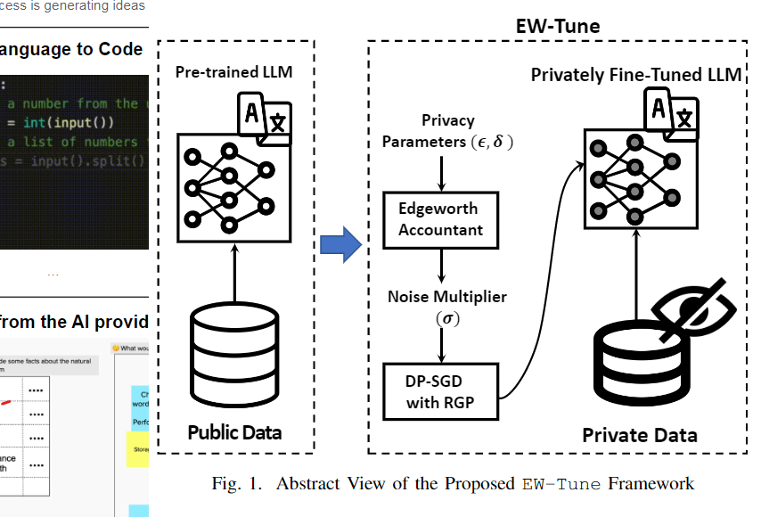
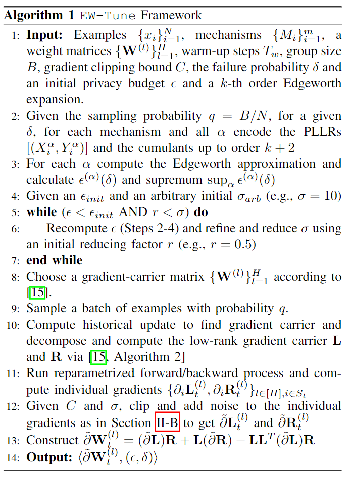

# Fine Tuning Models

## Privately Fine-Tuning LLM with Differential Privacy (2022)

Behnia, R., Ebrahimi, M. R., Pacheco, J., & Padmanabhan, B. (2022). EW-Tune: A Framework for Privately Fine-Tuning Large Language Models with Differential Privacy. 2022 IEEE International Conference on Data Mining Workshops (ICDMW), Data Mining Workshops (ICDMW), 2022 IEEE International Conference on, ICDMW, 560–566. https://doi.org/10.1109/ICDMW58026.2022.00078. [DifferPrivacy](DifferPrivacy.pdf).

### What are LLMs

> Large language models (LLMs) have become an integral component of modern AI. Deep learning architectures with billions of parameters are often designed based on transformers, a building block first introduced by Google’s BERT [1]. LLMs provide breakthrough performance in complex AI tasks such as dialogue systems [2] and text/automated story generation [3]. Being equipped with the hardware infrastructure, major AI companies such as Open AI and Facebook provide new LLMs trained on the public data from the Internet [4], [5]. Common examples include, RoBERTa [4] and GPT [5]. RoBERTa’s training dataset includes English Wikipedia and millions of
online news crawled from the internet. Similarly, GPT was trained on outbound links from Reddit.

>Large language models are deep neural network architectures with billions of parameters [16]–[18]. They often benefit from an encoder-decoder architecture that generates high-quality representations from sequence data (text, image, malware, genes, etc.). Most LLMs use specific types of layers with self-attention mechanisms known as transformers to dynamically assign weights to input elements based on their surrounding context [16]. Transformers enable LLMs to
provide high-quality representations of the input sequence. At a high level, LLMs can be categorized into two types: `masked` and `autoregressive`.

1. **Masked language model**s are trained to predict a masked token based on its surroundings. Highly effective examples of masked language models include BERT [1] and RoBERTa [16]. 
1. On the contrary, **autoregressive language models** learn to predict the next token based on the previously generated ones, which makes them suitable for text generation tasks [4], [19].

Due to their ability to produce high-quality representations from input, masked language models are widely used in major downstream AI tasks including **text classification, question answering, semantic entailment detection, and speech recognition**.

### What problem does this introduce

Since these models are indexing arbitrary data, there's risks that PII becomes known tokens and emitted in the responses. This scenario creates the need for noise and other defenses against adversary's reverse engineering the training data. Generally speaking, academics call this the `memorization issue`

> This problem is mainly due to the model’s tendency to memorize training samples without overfitting, also known as the `memorization issue` [9]. This issue could lead to three major types of privacy attacks: membership inference, model inversion, and training data extraction.

- Membership inference [10]: determines whether a certain user’s data was included in the training.
- Model inversion [11]: approximate the reconstruction of the training data.
- Training data extraction [8]: aims to exactly reveal the training samples which makes this type of attack the most powerful one with the most adverse consequences for the users.

### How can we mitigate these attacks

Differential privacy (DP) mitigates these attacks through a rigorous framework that makes it virtually infeasible for someone to get the true samples.

> Differential Privacy (DP) is a promising approach to ensure the training data privacy with theoretical guarantees [12]. DP provides a mathematically rigorous framework with privacy guarantees that enables Stochastic Gradient Descent (SGD), the cornerstone of learning in LLMs, in a private setting. In such a setting, SGD can be applied as a randomized mechanism multiple times in each iteration of the training. Most DP methods provide asymptotic guarantees. For theoretical guarantees, the number of SGD applications (known as compositions) is often assumed to be unlimited in most privacy studies. This assumption leads to asymptotic guarantees in these studies (i.e., infinite compositions of SGD in the limit). **However, in LLM fine-tuning the number of SGD iterations is not only limited but also quite small** (i.e., in the order of several thousand).

The researchers propose a mechanism for computing _privacy curves_ using Gradient clipping & Gaussian noise to randomize the tokens while minimizing the loss. Their paper gets into the math (see page 3) for specific details.

