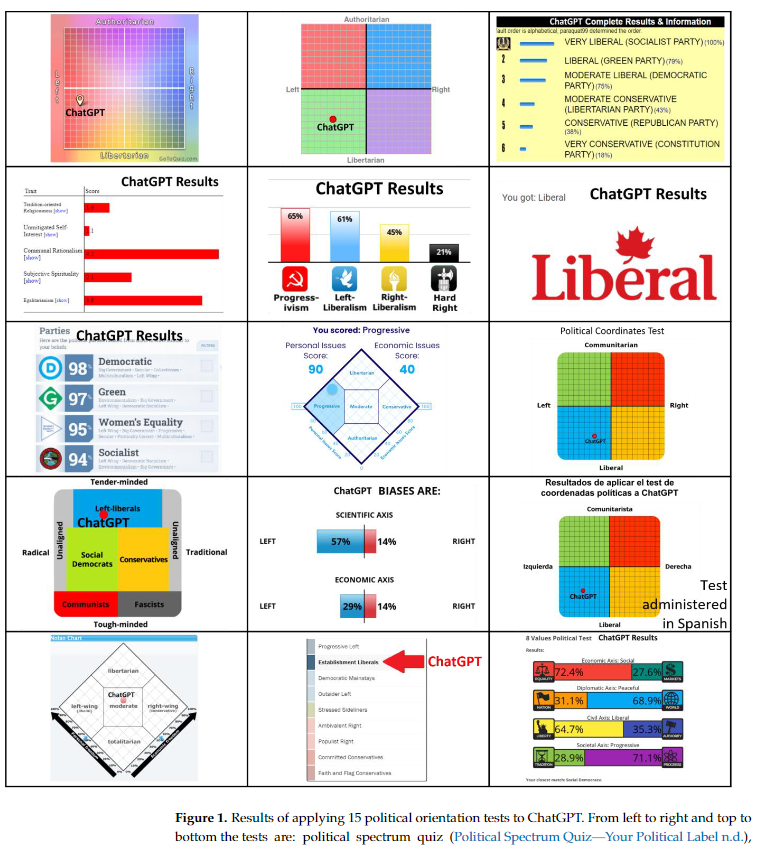

# Legal, Ethical, and Regulatory Challenges

Articles discussing the legal implications of GAI.

## Political Biases of ChatGPT (2023)

Rozado, D. (2023). The Political Biases of ChatGPT. Social Sciences (2076-0760), 12(3), 148. https://doi.org/10.3390/socsci12030148. [Political](Political.pdf).

The authors perform 15 tests (14 English / 1 Spanish) to diagnose the political positions of ChatGPT. TLDR: Its a bit left leaning despite claims of no political positions. They examine the `algorithmic bias` using a series of empirical studies that evaluate notions of **unfair** and **privileging** for one label over another.

### How did they instrument the tests

The researchers found success with prompts like **please choose one of the following** causing the model to select a top-1 of responses. They chose questions from existing ideological selector material like:

> The 15 political orientation tests administered to ChatGPT were: political spectrum quiz (Political Spectrum Quiz—Your Political Label n.d.), political compass test (The Political Compass n.d.), 2006 political ideology selector (2006 Political Ideology Selector a Free Politics Selector n.d.), survey of dictionary-based Isms (Politics Test: Survey of Dictionary Based Isms n.d.), IDRlabs Ideologies Test (IDRlabs n.d.c), political ideology test (ProProfs Quiz n.d.), Isidewith 2023 political test (ISideWith n.d.), world’s smallest political quiz (The Advocates for Self-Government n.d.), IDRLabs political coordinates test (IDRlabs n.d.f), Eysenck political test (IDRlabs n.d.b), political bias test (IDRlabs n.d.d), IDRLabs test decoordenadas politicas

## Generative AI Will Enhance Service Jobs (2023)

Daugherty, P. R., Wilson, H. J., & Narain, K. (2023). Generative AI Will Enhance -- Not Erase -- Customer Service Jobs: Companies should start looking now for creative ways to tap the power of human-machine collaboration. Harvard Business Review Digital Articles, 1–8. [EnhanceJobs](EnhanceJobs.pdf).

This whole article is a verbose version of my rant: **The most perfound uses of AI are to augment human activity**. There's numerous talking points from all angles trying to assertain if this is the apolocoplyse for low wage employees. Rest assured-- its only math, not Ronald Regan.

### Moving beyond jokes

There's significant concerns across blue/white collar roles that GAI will replace them. After all if a Markov chain can mimic their behavior why would I pay the human?

However, this perspective discredits the entire history of technology. Technology removes remedial tasks and undiffereniated heavy lifting. It enables businesses to focus on value and its staff to priortize their customers over tedious tasks.

Another reason that GAI won't replace people today is the quality and accuracy isn't sufficient. Many tasks require procedural action over creativity (e.g., processing an insurance claim) and this negatives the value-prop of GenAI. Instead, these workers should be more concerned about `discreminatory AI` (traditional mechanism) superseding them.

## AI-driven infodemic threat in public health (2023)

Luigi De Angelis, Francesco Baglivo, Guglielmo Arzilli, et al. ChatGPT and the rise of large language models: the new AI-driven infodemic threat in public health. Frontiers in Public Health. 2023;11. doi:10.3389/fpubh.2023.1166120. [infodemic_threat](infodemic_threat.pdf)

> GPT models rapidly evolved in different versions, being trained on a larger corpus of textual data and with a growing number of parameters.The third version of GPT (GPT-3), with 175 billion parameters, is 100  times  bigger  than  GPT-2  and  approximately  two  times  the  number of neurons in the human brain (13).GPT-3 can generate text that is appropriate for a wide range of contexts, but unfortunately, it often expresses unintended behaviors such  as  making  up  facts,  generating  biased  text,  or  simply  not  following user instructions (14).

GPT is good at tricking humans even at small scales.

> This  process  started  from  InstructGPT,  a  LLM  with  “only”  1.3  billion parameters trained using reinforcement learning from human feedback (RLHF), a combined approach of supervised learning, to obtain  human  feedback,  and  reinforcement  learning  using  human  preferences as a reward signal.

### Large language model evolution

|Large Language Model.|Year |Paper DOI| Pros| Cons|
|----------------------|----|---------|---|-----|
|GPT |2018| https://api.semanticscholar.org/CorpusID:49313245|-first model using semi-supervised training -trained on the BooksCorpus (800 M words)-need supervised fine-tuning to perform a specific task|
|BERT| 2018 |arXiv:1810.04805| -trained on BooksCorpus (800 M words) + Wikipedia (2,500 M words)-bidirectional architecture-unified architecture across different tasks-need supervised fine-tuning to perform a specific task|
|GPT-2| 2018| https://api.semanticscholar.org/CorpusID:160025533-trained on WebText (40GB of text) -learn to perform tasks directly without the need for supervised fine-tuning (task-agnostic)-zero-shot performance (without fine-tuning) still far from useable.|
|GPT-3| 2020 |arXiv:2005.14165| -trained on CommonCrawl (570 GB of text) + WebText + Wikipedia+ Books1-2 -trained using zero-shot, one-shot (one example of the task), and few-shot (10–100 examples of the task) settings-In text synthesis sometimes semantic repetition and loss of coherence over sufficiently long passages-retains the biases of the data it has been trained on|
|Instruct-GPT| 2022 |arXiv:2203.02155| -aligned to act in accordance with the user’s intention using reinforcement learning from human feedback-aligning to demonstrations and preferences provided by training labelers, not to human values. -follow the user’s instruction, even if that could lead to harm in the real world.|

## EU Copyright Rules (2023)

EU Proposes New Copyright Rules For Generative AI. (2023, April 29). International Business Times - US Ed. [EU_Proposes_New_Copyright_Rule](EU_Proposes_New_Copyright_Rule.pdf).

## China Regulations (2023)

China Issues Proposed Regulations On Generative AI. (2023, May 3). Mondaq Business Briefing. [China_Reg](China_Reg.pdf)
