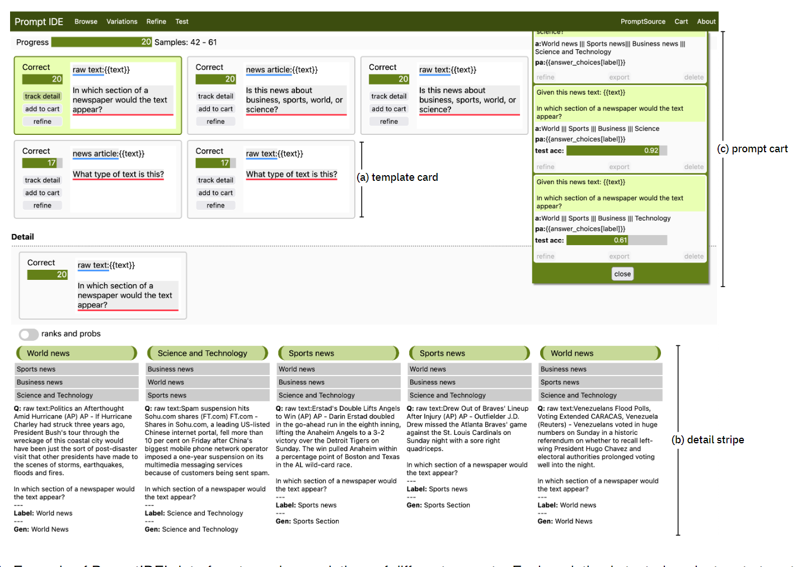
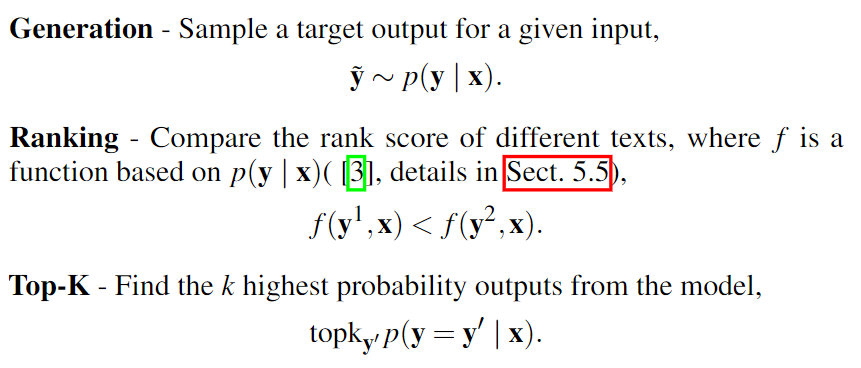
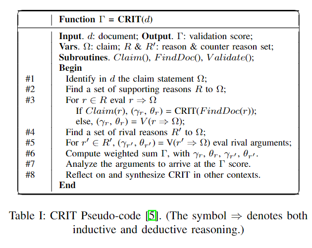
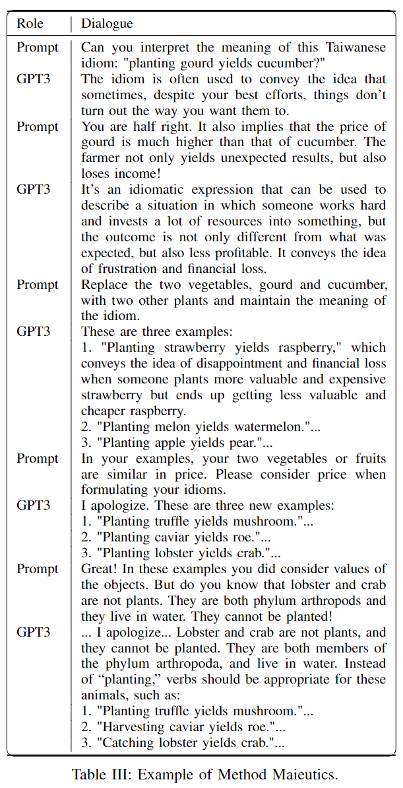

# Prompting

## Interactive and Visual Prompt Engineering (2023)

Strobelt, H., Webson, A., Sanh, V., Hoover, B., Beyer, J., Pfister, H., & Rush, A. M. (2023). Interactive and Visual Prompt Engineering for Ad-hoc Task Adaptation with Large Language Models. IEEE Transactions on Visualization and Computer Graphics, Visualization and Computer Graphics, IEEE Transactions on, IEEE Trans. Visual. Comput. Graphics, 29(1), 1146–1156. https://doi.org/10.1109/TVCG.2022.3209479. [PromptEngineering](PromptEngineering.pdf).

> The promise of prompting is that it allows domain experts to solve new tasks with only natural language inputs. However, while there are prompts that can achieve high accuracy on specific tasks, there is a large amount of variance in the choice of the prompt template itself. Recent papers have described how task accuracy is dependent on specifics of prompt choices [27, 41, 45]. This leads to a brute-force procedure under which dozens of prompts are written, evaluated, and compared to find the best fit for a task. In this sense, prompting transfers similar burdens of curating expert labels to prompt construction.

### What are prompt templates

The authors examine three queries types `Generation`, `Ranking`, and `Top-K`. In these scenarios the process entails providing the context, question, and response format.

The `context` should represent **mappings and known evidence**. For instance, you might specify that apples cost $1 and bananas cost $2 and cheese costs $3.50. These data points initialize the generation context and cause the neuro-symbolic resolver to incorporate these facts. `Questions` should define the goal and task definition. The `response format` is natural language statements that tell the LLM how to reduce the outputs.

### What are the top use-cases for prompting

- Document classification
- Multi-choice answering
- sentence similarity scoring

## A Systematic Survey of Prompting Methods in NLP (2023)

PENGFEI LIU, WEIZHE YUAN, JINLAN FU, ZHENGBAO JIANG, HIROAKI HAYASHI, & NEUBIG, G. (2023). Pre-train, Prompt, and Predict: A Systematic Survey of Prompting Methods in Natural Language Processing. ACM Computing Surveys, 55(9), 1–35. https://doi.org/10.1145/3560815. [MethodSurvey.pdf](MethodSurvey.pdf).

## Prompting LLM with Socratic Method (2023)

Chang, E. Y. (2023). Prompting Large Language Models With the Socratic Method. 2023 IEEE 13th Annual Computing and Communication Workshop and Conference (CCWC), Computing and Communication Workshop and Conference (CCWC), 2023 IEEE 13th Annual, 0351–0360. https://doi.org/10.1109/CCWC57344.2023.10099179. [SocraticMethod](SocraticMethod.pdf).

> Prompting is a technique used to guide the output generation of a pre-trained language model such as GPT-3 [2]. This is achieved by providing input in the form of a question or template, which helps to generate specific responses such as Q&A, document summarization, and translations. The advent of ChatGPT [11, 23, 41] has revolutionized the field of NLP by demonstrating the potential of using large pre-trained language models with prompting. Despite this progress, there is still room for improvement in current prompting strategies and techniques, especially for specific target applications.

### What is the Socratic Method

Conner (nd). The Socratic Method: Fostering Critical Thinking. Colorado State University. Retrieved from https://tilt.colostate.edu/the-socratic-method. [WhatIs_SocraticMethod.pdf](WhatIs_SocraticMethod.pdf).

Explains that its an intentional process for extrapolating foundational believes in one's perspectives. The game has two personas: the teacher and student. Each turn begins with the teacher asking an open-ended question and then taking the opposite side of the student's response.

> “The Socratic professor,” Reich states, “is not the opponent in an argument, nor someone who always plays devil’s advocate, saying essentially: ‘If you affirm it, I deny it. If you deny it, I affirm it.’ This happens sometimes, but not as a matter of pedagogical principle.”

### What types of Socratic questions exist

> In their work on “Critical Thinking: The Art of Socratic Questioning,” Paul and Elder identify three types of Socratic questioning: spontaneous, exploratory, and focused [27]. `Focused questioning` (type 2), on the other hand, is geared towards gaining knowledge and truth, and methods such as **definition, elenchus (cross-examination), hypothesis elimination, dialectic, and generalization** hold great potential for developing effective prompting strategies and improving the response accuracy of a large language model (LLM). Additionally, `exploratory thinking` (type 3) can be supported through the maieutics (midwife) method, induction, and counterfactual reasoning, which can guide GPT-3 towards producing imaginative and creative writing. While many of the plot suggestions generated by GPT-3’s exploration may not be useful, a few unique recommendations in response to a "what if" query can stimulate the writer’s imagination and lead to remarkable results.

Some of the Socratic method’s key principles and guidelines to conduct critical thinking include:
• Posing open-ended questions: The teacher or facilitator starts with a question to stimulate thinking and draw out ideas.
• Clarifying key terms: The teacher helps the students clarify and define relevant terms and concepts to ensure everyone is on the same page.
• Providing examples and evidence: The teacher or facilitator encourages the students to provide examples and evidence as reasons to support their claims.
• Challenging reason-to-conclusion argument: The teacher or facilitator challenges the students’ arguments and encourages them to question their own beliefs and to consider alternative perspectives.
• Summarizing and drawing conclusions: The teacher helps the students summarize and draw conclusions from the discussion.
• Reflecting on the process: The teacher and students reflect on the effectiveness of the method and what they learned through the dialogue

### How was this appraoch helpful

The authors formulate a series of prompts and follow up questions, which forces the LLM to explain the reasoning in terms of multiple choice selection. **This solution sides steps the governance checks and extrapolates the true answers.**

The researchers were able to probe the neuro-symbolic mappings and refine the outputs more concretely. This allows **the chat session** to become more sophisticated due to related terms.

## Prompt Programming (2021)

Reynolds, L., & McDonell, K. (2021). Prompt Programming for Large Language Models: Beyond the Few-Shot Paradigm. Extended Abstracts of the 2021 CHI Conference on Human Factors in Computing Systems, 1–7. https://doi.org/10.1145/3411763.3451760. [PromptProgramming](PromptProgramming.pdf).

## Inverse Prompting (2021)

Zou, X., Yin, D., Zhong, Q., Yang, H., Yang, Z., & Tang, J. (2021). Controllable Generation from Pre-trained Language Models via Inverse Prompting. Proceedings of the 27th ACM SIGKDD Conference on Knowledge Discovery & Data Mining, 2450–2460. https://doi.org/10.1145/3447548.3467418. [InversePrompting](InversePrompting.pdf).

## Language-Guided Dense Prediction with Context-Aware Prompting (2022)

Rao, Y., Zhao, W., Chen, G., Tang, Y., Zhu, Z., Huang, G., Zhou, J., & Lu, J. (2022). DenseCLIP: Language-Guided Dense Prediction with Context-Aware Prompting. 2022 IEEE/CVF Conference on Computer Vision and Pattern Recognition (CVPR), Computer Vision and Pattern Recognition (CVPR), 2022 IEEE/CVF Conference on, CVPR, 18061–18070. https://doi.org/10.1109/CVPR52688.2022.01755. [DenseClip](DenseClip.pdf).
