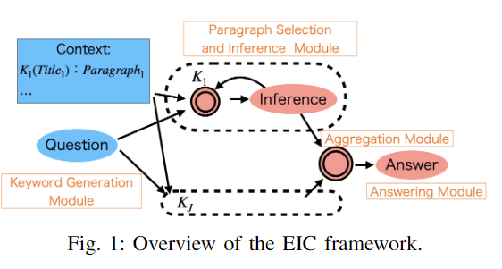
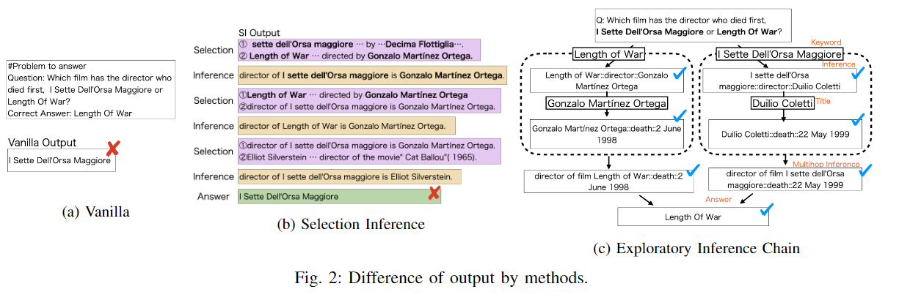

# Language Model Chaining

## Exploratory Inference Chain (2023)

Haji, S., Suekane, K., Sano, H., & Takagi, T. (2023). Exploratory Inference Chain: Exploratorily Chaining Multi-hop Inferences with Large Language Models for Question-Answering. 2023 IEEE 17th International Conference on Semantic Computing (ICSC), Semantic Computing (ICSC), 2023 IEEE 17th International Conference on, ICSC, 175–182. https://doi.org/10.1109/ICSC56153.2023.00036. [Exploratory_Inference](Exploratory_Inference.pdf).

Researchers are finding success with few-shot question-answering LLM for variety of tasks. However, the performance of multi-hop inference is not sufficient. This scenario limits their ability to handle general tasks and are only effective against a subset.

> To address these problems, we propose the Exploratory Inference Chain (EIC) framework that combines the implicit processing of LLMs with explicit inference chains, and this is based on the dual process theory of human cognitive processes.

### What is neuro-symbolic approach

There's a reoccurring theme that LLMs don't perform well under single-shot tasks, but do well under few-shot and other multi-prompting scenarios. My naive theory is that the prompt must initialize a context and then perform a seq2seq transform which requires state somewhere in the operation.

Building that rich state necessitates a `map-reduce` paradymn performs entity resolution and identifies properties/characteristics. This information becomes inputs to secondary, tetriaray, etc. stages of resolution.

As each of these stages occurs, the `prompt` contains more extensive `state` permitting the LLM to generate more refined `Chain of Thought` output. **This process of decomposing tasks and resolving entities across multi-hop operations is called `neuro-symbolic reasoning`**

### How does vanilla vs no context perform

The researchers discuss challenges using the vanilla model for predictions. They note that a more precise pipeline without context outperforms a generic model regarding accuracy. However once the model exceeded 100B parameters vanilla was an superior (vs 6B GPT).

> For 2WikiMultihopQA, the accuracy of Vanilla was lower than that of No context. That may be due to the input to Vanilla containig a lot of information that did not lead to an answer, and this became noise. Thus, it indicates that even if the context is closely related to the question, the accuracy will get worse without selecting the appropriate text. The accuracy of COT was lower than that of Vanilla, which  is consistent with previous works showing that this only occurs
at a scale of more than 100B model parameters. That is, the 6B parameters GPT used in this experiment is insufficient in its ability to perform multi-hop inference in a single call.
In comparison, Selection Inference and our EIC showed better accuracy than the methods above. That confirms that the neuro-symbolic approach in LLMs is effective, regardless of the scale of the model. As shown in the experimental settings, even though Selection Inference had a more favorable setting compared with the EIC, the EIC achieved better accuracy. This quantitatively confirms the effectiveness of our EIC. Finally, the accuracy scores for Input Support were 0.430 and 0.438, respectively, which are lower than those of the larger LLMs in previous work. As shown in the following qualitative evaluation, the model used in the experiment fails even the simplest inferences.

## Symbolic Math Reasoning (2022)

Gaur, V., & Saunshi, N. (2022). Symbolic Math Reasoning with Language Models. 2022 IEEE MIT Undergraduate Research Technology Conference (URTC), Undergraduate Research Technology Conference (URTC), 2022 IEEE MIT, 1–5. https://doi.org/10.1109/URTC56832.2022.10002218. [SymbolicMath](SymbolicMath.pdf).

There is a recent renesannace of using LM models for every business challenge. However, there's still a foundamental challenge that LLMs are `seq2seq` Markov Chians. Within that sequence isn't a notion of math and physics computations.

> We find that the manual eval of symbolic accuracy (66%) of LMs is quite high, not much lower than the numeric accuracy (72%),  despite  potentially  being  a  more  challenging  task. Secondly,  we  find  that  a  two-step  evaluation  can  lead  to accuracy at the same level as solving the numeric task directly, with an added advantage of being able to debug the incorrect answers better.

### Whats the goal of this paper

> This  paper  primarily  focuses  on  evaluating  GPT-3  on symbolic tasks, though we have provided metrics for runs on numerical  questions  as  a  means  to  compare  results.  Both symbolic and numerical accuracies were calculated manually due to the high variance in model outputs. Answer extraction
helped isolate the final output in most cases but also included unnecessary  information  occasionally.  This  meant  that automatic extraction would not have been reliable in the current state and could either miss the actual output of the model or be confused by other values present.
