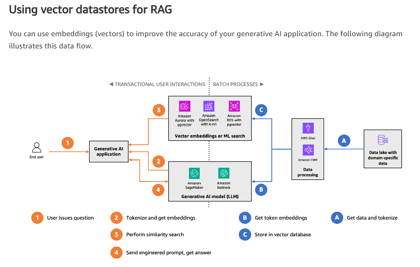

# Vector databases

This section contains resources for vector databases.

## What is Vector Search (2023)

Lavoie, J (2023). What is vector search. Elastic.co. https://www.elastic.co/what-is/vector-search.

In this video Elastic.co explains in [17mins the high-level overview](https://videos.elastic.co/watch/dJ7cLsPw9tHoEJhERYLR11?) of the concepts, use cases, and applications. If this is your first time learning about the concept, start here.


## WordPiece Tokenization (n.d.)

Hugging Face(n.d.) WordPiece tokenization. https://huggingface.co/learn/nlp-course/chapter6/6?fw=pt. [wordpiece.pdf](wordpiece.pdf)

This tutorial explains how BERT and related models tokenize text from single characters into multi-character `tokens`. The algorithm starts uses a `score` metric to determine when to merge multiple tokens (letters) together. Its a non-greedy learner that discovers combinations like `un` and `able` occur very frequently and shouldn't converge into `unimaginable` but remain as `[un][imagin][able]`.

Like other codebook systems, the vocabulary size is critical for maintaining the compete context. For instance, the Shakespeare dataset (1MB) doesn't have enough examples to justify a 2^32 (4.2B) tokens-- you'd end up with a sparse matrix and overfitting. Similarly, the Wikipedia dataset (1TB) is too large for 2^10 (1024) tokens.

Researchers can mitigate these challenges with statistical models using industry-standard big data tooling (e.g., Apache Spark) and generic Python code.

```python
score=(freq_of_pair)/(freq_of_first_element×freq_of_second_element)
```

## Manu: A Cloud Native Vector Database Management System (2022)

Guo, R., Luan, X., Xiang, L., Yan, X., Yi, X., Luo, J., Cheng, Q., Xu, W., Luo, J., Liu, F., Cao, Z., Qiao, Y., Wang, T., Tang, B., & Xie, C. (2022). Manu: A Cloud Native Vector Database Management System. https://doi.org/10.48550/arXiv.2206.13843. [Manu.pdf](Manu.pdf).

> According to IDC, unstructured data, such as text, images, and video, took up about 80% of the 40,000 exabytes of new data generated in 2020, their percentage keeps rising due to the increasing amount of human-generated rich media [48]. With the rise of learningbased embedding models, especially deep neural networks, using embedding vectors to manage unstructured data has become commonplace in many applications such as e-commerce, social media, and drug discovery [49, 63, 68]. A core feature of these applications is that they encode the semantics of unstructured data into a high-dimensional vector space. Given the representation power of embedding vectors, operations like recommendation, search, and analysis can be implemented via similarity-based vector search. To support these applications, many specialized vector databases are built to manage vector data.

A vector database can compare trillions of high-dimensional data points in milliseconds, which enables:

- Recommendation systems
- Multimedia search
- Medicine/chemistry search
- Security event search

These vector search capabilities require indexes optimized for:

| Capability| Algorithm|Definition|
|------------|----------|-------|
|Vector quantization| PQ, OPQ, RQ, SQ |A lossy data compression for density estimation and clustering|
|Inverted indexes|IVF-Flat, IVF-PQ, IVF-SQ, IVF-HNSW, IMI |A lookup mechanims like an Index in a book|
|Proximity graphs|HNSW, NSG, NGT |Matrics that represent relationships between vectors |
|Numerical Attribute|B-Tree, Sorted List |Metadata/property filtering|

> Vector quantization (VQ) [34, 45] methods compress vectors to reduce memory footprint and the costs for vector distance/similarity computation. For example, scalar  quantization (SQ) [91] maps each dimension of vector (data types typically are int32 and float) to a single byte. Inverted indexes [69] group vectors into clusters, and only scan the most promising clusters for a query. Proximity graphs [33, 42, 61] connect similar vectors to form a graph, and achieve high accuracy and low latency at the cost of high memory consumption.

### How do requirements differ from RDBMS

The authors released the first verison of [Milvus](https://github.com/milvus-io/milvus) in 2019 and based on feedback from 1200+ users __concluded the following features aren't helpful__:

- Transaction and analytical optimizations
- Attribute filtering and Multi-Vector search
- Multi-table joins are not a common use case
- Row-level ACID is sufficient for most scenarios

What users expect are:

- __Support for complex transactions is not necessary__. Instead of decomposing entity representations into different fields or tables, learning-based models encode complex and hybrid data semantics into a single vector. As a result, multi-row or multitable transactions are not necessary; row-level ACID is sufficient for the majority of vector database applications.
- __A tunable performance-consistency trade-off is important__. Different users have different consistency requirements; some users prefer high throughput and eventual consistency, while others require some level of guaranteed consistency, i.e., newly inserted data should be visible to queries either immediately or within a pre-configured time. Traditional relational databases
generally support either strong consistency or eventual consistency; there is little to no room for customization between these two extremes. As such, tunable consistency is a crucial attribute for cloud-native vector databases.
- __High hardware cost calls for fine-grained elasticity__. Some vector database operations (e.g., vector search and index building) are computationally intensive, and hardware accelerators (e.g. GPUs or FPGAs) and/or a large working memory are required for good performance. However, depending on application types, workload differs amongst database functionalities. Thus, resources can be wasted or improperly allocated if the vector database does not have fine-grained elasticity. This necessitates a careful decoupling of functional and hardware layers; systemlevel decoupling such as separation of read and write logic is insufficient, elasticity and resource isolation should be managed at the functionalities level rather than the system level.

### How is Milvus architected

The authors chose an event stream-based architecture where incoming records pub/sub across a durable event stream. A periodic `time-tick` message is also written to the stream so consumers can balance `Multi-Version Consistency Control (MVCC)` (similar to Apache Flink). This ensures the subscribers are not drifting too far and degrading consistency.


The authors implement a storage system based on `collections` (tables), `shards`, (partitions) and `segments` (pages). A segment grows to 512MB before transitioning from `growing` to `sealed`. There are many shard replicas across worker and query nodes for distributing the load for demanding systems.


### What are typical hardware requirements

Practitioners need to consider their application requirements in terms of ingestion and search throughput. There's challenges finding an arbitrary record after the fact (e.g., poor locality) and this necessitates creating an index of the right type upfront. For instance, if the use case is `Vector quantization` its possible to encode the cluster distances at time-of-write to simiply time-of-read. This is analogous to having a "live k-NN network" and smartly inserting one more node.

> Vector databases have more stringent and diversified hardware requirements compared with traditional databases. This is attributed to three reasons.
>
> 1. __First__, vector database operations are computation-intensive, and thus hardware accelerators such as GPUs are critical for computing functionalities such as search and indexing.
> 2. __Second__, accesses to vector data (e.g., search or update) generally have poor locality, thereby requiring large RAM for good performance.
> 3. __Third__, different applications vary significantly in their resource demands for the system functionalities. Core functionalities of a vector database include data insertion, indexing, filtering, and vector search. Applications such as video recommendation require online insertion and high concurrency vector search. In contrast, for interactive use cases such as drug discovery, offline data ingestion and indexing are generally acceptable. Although interactive applications usually require lower throughput than recommendation systems, they have high demands for realtime filtering, similarity-based vector search, and hybrid queries. The high hardware costs as well as diverse workload features call for fine-grained elasticity.

### How is vector database industry evolving

Vector data management solutions have gonethrough two stages of development.

> Solutions in the first stage are libraries (e.g., Facebook Faiss [46], Microsoft SPTAG [16], HNSWlib [61] and Annoy [1]) and plugins (e.g., ES plugins [6], Postgres plugins [12]) for vector search. They are insufficient for current applications as full-fledged management functionalities are required, e.g., distributed execution for scalability, online data update, and failure recovery. Two OLAP database systems, AnalyticDB-V [82] and PASE [85] support vector data by adding a table column to store them but lacks optimizations tailored for vector data.
>
> The second stage solutions are full-fledged vector databases such as Vearch [52], Vespa [19], Weaviate [20], Vald [18], Qdrant [13], Pinecone [11], and our previous effort Milvus [81]. 6 Vearch uses Faiss as the underlying search engine and adopts a three-layer aggregation procedure to conduct distributed search. Similarly, Vespa distributes data over nodes for scalability. A modified version of the HNSW algorithm is used to support online updates for vector data, and Vespa also allows attribute filtering during search and learningbased inference on search results (e.g., for re-ranking). Weaviate adopts a GraphQL interface and allows storing objects (e.g., texts, images), properties, and vectors. Users can directly import vectors or customize embedding models to map objects to vectors, and Weaviate can retrieve objects based on vector search results. Vald supports horizontal scalability by partitioning a vector dataset into segments and builds indexes without stopping search services. Qdrant is a single-machine vector search engine with extensive support for attribute filtering. It allows filtering with various data types and query conditions (e.g., string matching, numerical ranges, geo-locations), and uses a tailored optimizer to determine the filtering strategy. Note that Vespa, Weaviate and Vald only support proximity graph index.

## Universal NFT Vector Database (2023)

The Universal NFT Vector Database: A Scaleable Vector Database for NFT Similarity Matching. (2023). https://doi.org/10.48550/arXiv.2303.12998. [NFT.pdf](NFT.pdf).

Non-fungible tokens are intended to be unique assets within a blockchain, however, this is challenging inpractice because the artifacts are stored offchain and rely on simple hashing mechanisms. Actors can make trivial changes (e.g., bitflip) on the images to create new asset signatures. This trivial workaround led to thousands of duplicate artwork and defeats the purpose of NTFs.

The authors built a pipleine for crawling these NTF artifacts and loading them into Pinecoin. This approach lets them do similarity comparisons between images and predict the likelihood of being duplicates. This article contains additional details on mechanisms for collecting NTF assets within a high-throughput configuration.


### How did they vectorize the images

The authors used [TensorFlows RegNetY080](https://www.tensorflow.org/api_docs/python/tf/keras/applications/regnet/RegNetY080) to convert each image into a 2016x1 vector.

Users can discover related images by:

1. Uploading base64-encoded graphic
2. The service derives the RegNetY-080 embedding
3. Search Pinecone using the `cosine similarity` API

## The role of vector datastores in generative AI applications (2023)

Krishnamoorthy, Pathak, and Vlasceanu (2023). The role of vector datastores in generative AI applications. https://aws.amazon.com/blogs/database/the-role-of-vector-datastores-in-generative-ai-applications/. [VDB_for_GenAI](VDB_for_GenAI.pdf).



### Using Aurora PostgreSQL or Amazon RDS for PostgreSQL with pgvector

Pgvector, an open-source, community-supported PostgreSQL extension, is available both in Aurora PostgreSQL and Amazon RDS for PostgreSQL. The extension expands PostgreSQL with a vector data type called vector, three query operators for similarity searching (Euclidian, negative inner product, and cosine distance), and the ivfflat (inverted file with stored vectors) indexing mechanism for vectors to perform faster approximate distance searches. __Although you can store vectors with up to 16,000 dimensions, only 2,000 dimensions can be indexed__ to improve similarity search performance. In practice, customers tend to use embeddings with fewer dimensions. The post [Building AI-powered search in PostgreSQL using Amazon SageMaker and pgvector](https://aws.amazon.com/blogs/database/building-ai-powered-search-in-postgresql-using-amazon-sagemaker-and-pgvector/) is a great resource to dive deeper into this extension.

You should __strongly consider using Aurora PostgreSQL with the pgvector extension for your vector datastore if you are already heavily invested in relational databases, especially PostgreSQL__, and have a lot of expertise in that space. Also, highly structured domain-specific datasets are a more natural fit for relational databases. Amazon RDS for PostgreSQL can also be a great choice if you need to use specific community versions of PostgreSQL. Similarity search queries (reads) can also scale horizontally subject to the maximum number of read replicas supported by Aurora in a single DB cluster (15) and Amazon RDS in a replication chain (15).

### Using OpenSearch Service with the k-NN plugin and the vector engine for OpenSearch Serverless

The k-NN plugin expands OpenSearch, an open-source, distributed search and analytics suite, with the custom knn_vector data type, enabling you to store embeddings in OpenSearch indexes. The plugin also provides three methods to perform k-nearest neighbor similarity searches: Approximate k-NN, Script Score k-NN (exact), and the Painless extensions (exact). OpenSearch includes the Non-Metric Space Library (NMSLIB) and Facebook AI Research’s FAISS library. You can use different search algorithms for distance to find the best one that meets your needs. This plugin is also available in OpenSearch Service, and the post [Amazon OpenSearch Service’s vector database capabilities explained](https://aws.amazon.com/blogs/big-data/amazon-opensearch-services-vector-database-capabilities-explained/) is a great resource to dive deeper into these features.

Due to the distributed nature of OpenSearch, it’s a great choice for vector datastores with a very large number of embeddings. Your indexes scale horizontally, allowing you to handle more throughput for storing embeddings and performing similarity searches. It’s also a great choice for customers who want to have deeper control over the method and algorithms used to perform searches. Search engines are designed for low-latency, high throughput querying, trading off transactional behavior to achieve that.

## Find anything blazingly fast with Google's vector search technology (2021)

Satom K; Chikanagam T (2021).Find anything blazingly fast with Google's vector search technology. Google Developers & Practitioners. https://cloud.google.com/blog/topics/developers-practitioners/find-anything-blazingly-fast-googles-vector-search-technology. [FindFast](FindFast.pdf)

This post describes the use cases and applications for [Vertex AI Matching Engine](https://cloud.google.com/vertex-ai/docs/matching-engine/overview). Google's vector database has been available to users for at least two years.

### How does Vector search changes business

> Vector search is not only applicable to image and text content. It can also be used for information retrieval for anything you have in your business when you can define a vector to represent each thing. Here are a few examples:

- Finding similar users: If you define a vector to represent each user in your business by combining the user’s activities, past purchase history, and other user attributes, then you can find all users similar to a specified user.  You can then see, for example, users who are purchasing similar products, users that are likely bots, or users who are potential premium customers and who should be targeted with digital marketing.

- Finding similar products or items: With a vector generated from product features such as description, price, sales location, and so on, you can find similar products to answer any number of questions; for example, "What other products do we have that are similar to this one and may work for the same use case?" or "What products sold in the last 24 hours in this area?” (based on time and proximity)

- Finding defective IoT devices: With a vector that captures the features of defective devices from their signals, vector search enables you to instantly find potentially defective devices for proactive maintenance.

- Finding ads: Well-defined vectors let you find the most relevant or appropriate ads for viewers in milliseconds at high throughput.

- Finding security threats: You can identify security threats by vectorizing the signatures of computer virus binaries or malicious attack behaviors against web services or network equipment.

- ...and many more: Thousands of different applications of vector search in all industries will likely emerge in the next few years, making the technology as important as relational databases.

> OK, vector search sounds cool. But what are the major challenges to applying the technology to real business use cases? Actually there are two:

- Creating vectors that are meaningful for business use cases

- Building a fast and scalable vector search service

### How does vector quantization speep up search


In many use cases, you don't need the `exact` nearest neighbor and selecting an `approximate` neighbor is sufficient. For instance, your customer shows you a picture of their red bag and asks what similar items are in stock. You can pick any red bag to start the conversation and then scope it through additional attribute filters (e.g., brand and price).


### How did they create embeddings

The first challenge is creating vectors for representing various entities that are meaningful and useful for business use cases. This is where deep learning technology can really shine. In the case of the MatchIt Fast demo, the application simply uses a pre-trained [MobileNet v2 model](https://tfhub.dev/google/imagenet/mobilenet_v2_100_224/feature_vector/5) for extracting vectors from images, and the [Universal Sentence Encoder (USE)](https://tfhub.dev/google/collections/universal-sentence-encoder) for text.


## Synthesis of Quantum Vector Databases Based on Grovers Algorithm

Pronin, C. B., & Ostroukh, A. V. (2023). Synthesis of Quantum Vector Databases Based on Grovers Algorithm. http://arxiv.org/abs/2306.15295. [Grover.pdf](Grover.pdf).

> The process of creating meaningful embeddings is handled by a classical computer and the search process is handled by the quantumcomputer. This search approach might be beneficial for a large enough database, or it couldbe seen as a very qubit-efficient (super dense) way for storing data on a quantumcomputer, since the proposed circuit stores many embeddings inside one quantumregister simultaneously.

Grover (1999) lets you select an item from an unsorted list in `O(sqrt(N))` time. The authors store the application state in a vector database and then reference those vectors during the amplification step. This operation gives priority to know valid superpositions and reduces the search space.

They discuss future research potential that reduces the total qubits necessary for complex operations. This behavior is similar to the growing trend in LLM models as researchers find creative ways to cram more context into the relatively small prompt space.
